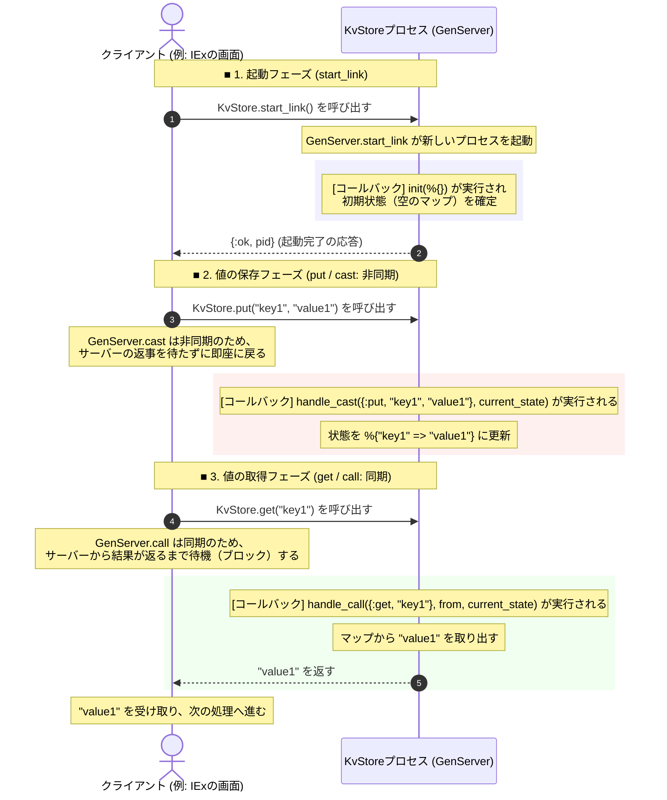
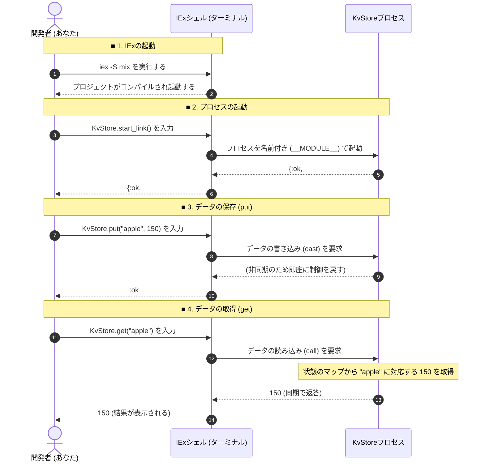

## 動作確認の手順と流れ

以下は、`iex -S mix` を使って実際にこの `KvStore` を起動し、動作確認を行う際の流れを示す図です。



### 動作確認コードの例

実際にターミナルやIEx上で入力するコマンドの例です。

```elixir
# 1. ターミナルでプロジェクトを読み込んでIExを起動します
# iex -S mix

# 2. KvStoreプロセスを起動します（すでに自動起動する設定になっている場合は不要です）
KvStore.start_link()

# 3. "apple" というキーに 150 という値を保存します
KvStore.put("apple", 150)

# 4. "apple" というキーの値を取得します
KvStore.get("apple")
# => 150 が返ってくれば動作確認完了です！
```
